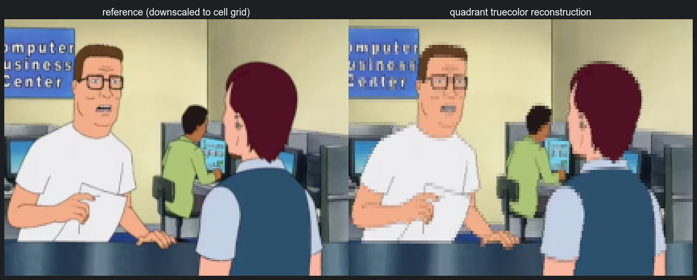

# Cell Render

Zig-first terminal visual rendering for images, diagrams, and TUI surfaces.

Cell Render turns visual inputs into terminal-native cells: raw images, semantic diagrams, and future agent/TUI visualization primitives. The core library accepts caller-owned data and returns `Frame` output or ANSI through caller-supplied writers. Decoding, terminal probing, layout ownership, and app lifecycle stay outside core.

```text
ImageView / Diagram IR -> cell renderer -> Frame -> ANSI / diff writer / TUI buffer
```

The durable product is a small, embeddable terminal renderer for TUI apps and agentic planning surfaces, with Siftable as
the first integration target.

## Demo — Do I look like I know what a JPEG is?



Left: the source frame downscaled to the cell grid. Right: the same frame rendered to terminal cells and decoded
back to pixels. At a `120x40` target this resolves to a `107x40` cell grid and scores **PSNR 28.06 dB / SSIM 0.946 /
edge-correlation 0.945** against the reference.

GitHub markdown can't display truecolor ANSI, so the right pane is the quality harness' pixel reconstruction of the
emitted cells (each quadrant cell painted as its exact 2×2 subblock with the solved foreground/background colors), not a
terminal screenshot. It was generated exactly as:

```sh
# 1. Downscale the source screenshot to a PPM the harness can read (decoder lives outside core):
magick king-of-the-hill.jpeg -resize 1024x testdata/generated/hank.ppm

# 2. Render to quadrant truecolor cells, then reconstruct + score and write both pixel buffers:
zig build compare -- --input testdata/generated/hank.ppm \
    --width 120 --height 40 --mode partition --partition quadrant --color truecolor --fit contain \
    --write-recon tools/out/hank-recon.ppm --write-ref tools/out/hank-ref.ppm

# 3. Upscale 3× nearest-neighbor and stitch the labeled side-by-side:
magick tools/out/hank-ref.ppm   -filter point -resize 300% docs/_ref.png
magick tools/out/hank-recon.ppm -filter point -resize 300% docs/_recon.png
magick \( docs/_ref.png -gravity North -background '#1d1f21' -splice 0x28 \
            -fill white -pointsize 18 -annotate +0+4 'reference (downscaled to cell grid)' \) \
       \( docs/_recon.png -gravity North -background '#1d1f21' -splice 0x28 \
            -fill white -pointsize 18 -annotate +0+4 'quadrant truecolor reconstruction' \) \
       +append -background '#1d1f21' -bordercolor '#1d1f21' -border 8 docs/hank-comparison.png
```

## Design Commitments

- raw RGBA `ImageView` input — the caller owns the pixels,
- terminal diagram primitives use `CellCanvas` and export the same `Frame` output contract,
- caller-controlled `TerminalProfile` (dimensions, cell aspect, color, symbols, background),
- allocator-owned, structure-of-arrays `Frame` output (`codepoints` / `fg` / `bg`),
- color accumulation in linear light, encoded back to sRGB at emission,
- streaming `renderToWriter` for CLI/log use,
- **no decoder dependency, no terminal probing, and no font rasterizer in core** — those live in the CLI, adapters, or
  `tools/`.

See [RESEARCH.md](RESEARCH.md) for the architecture rationale and [PLAN.md](PLAN.md) for the milestone plan.
See [docs/TUI_INTEGRATION.md](docs/TUI_INTEGRATION.md) for live TUI embedding with `PreparedImage`,
`RenderWorkspace`, `Frame`, and ANSI diffing.
See [docs/DIAGRAM_RENDERING.md](docs/DIAGRAM_RENDERING.md) for the terminal diagram path and Mermaid subset roadmap.
See [THIRD_PARTY_NOTICES.md](THIRD_PARTY_NOTICES.md) for decoder/tool dependency attribution.

## Build

Requires Zig `0.16.0`.

```sh
zig build           # build the CLI
zig build test      # run all tests (library, CLI, bench, tools)
zig build run -- --help
zig build bench     # renderer benchmark matrix (CSV on stdout)
zig build compare   # quality harness: render -> reconstruct -> score
zig build calibrate # generate/inspect a glyph atlas (tools only)
```

## Core API

```zig
const ascii = @import("image_to_ascii");

var frame = try ascii.renderToCells(allocator, image, terminal, options);
defer frame.deinit(allocator);
```

A complete render from caller-owned pixels:

```zig
const ascii = @import("image_to_ascii");

const image: ascii.ImageView = .{
    .width = width,
    .height = height,
    .stride = width * @sizeOf(ascii.Rgba8),
    .pixels = pixels, // []const Rgba8, caller-owned
};

var frame = try ascii.renderToCells(
    allocator,
    image,
    .{ .columns = 80, .rows = 24, .color = .truecolor },
    .{ .mode = .partition, .partition = .half_1x2 },
);
defer frame.deinit(allocator);
// frame.codepoints / frame.fg / frame.bg are parallel SoA arrays.
```

Stream ANSI to any `std.Io.Writer` instead of materializing cells:

```zig
try ascii.renderToWriter(writer, allocator, image, terminal, options);
// or, if you already hold a Frame:
try ascii.renderFrameToWriter(writer, frame);
```

For TUI redraws, diff two frames and emit only changed row-contiguous runs:

```zig
const stats = try ascii.renderFrameDiffToWriter(
    writer,
    &previous_frame,
    &current_frame,
    .{ .origin_row = 1, .origin_col = 1 },
);
_ = stats.bytes_emitted;
```

For a full live-render loop, resize behavior, and Siftable-style ownership split, see
[docs/TUI_INTEGRATION.md](docs/TUI_INTEGRATION.md).

### CellCanvas

`CellCanvas` is the mutable terminal drawing substrate for boxes, orthogonal lines, arrows, and labels. It is separate
from image sampling and exports to the same `Frame` type used by the image renderers, so the existing ANSI writer and
ANSI diff writer work unchanged.

```zig
var canvas = try ascii.CellCanvas.init(allocator, 40, 12, .truecolor);
defer canvas.deinit(allocator);

try canvas.drawBox(.{ .x = 1, .y = 1, .width = 16, .height = 5 }, .{});
try canvas.drawText(4, 3, "Plan", .{});
try canvas.drawArrow(.{ .x = 18, .y = 3 }, .{ .x = 28, .y = 3 }, .{});

var frame = try canvas.toFrame(allocator);
defer frame.deinit(allocator);
try ascii.renderFrameToWriter(writer, frame);
```

The canvas supports Unicode box drawing and ASCII fallback glyph sets. Mermaid support builds on top of this path:
`Mermaid text -> parser -> Diagram IR -> layout -> CellCanvas -> Frame`, not `Mermaid -> SVG/PNG -> image renderer`.

### Mermaid flowchart frontend

The first diagram frontend renders a practical Mermaid flowchart subset to terminal cells through a semantic pipeline:
`Mermaid text -> parser -> graph IR -> layered layout -> CellCanvas -> Frame`. One call parses, lays out, routes, and
renders:

```zig
var diagnostic: ?ascii.MermaidError = null;
var frame = ascii.renderMermaidFlowchart(allocator, source, .{
    .glyph_set = .unicode_box, // or .ascii
    .color = .truecolor, // or .none
}, &diagnostic) catch |err| {
    if (diagnostic) |d| std.debug.print("{d}:{d}: {s}\n", .{ d.line, d.column, d.message });
    return err;
};
defer frame.deinit(allocator);
try ascii.renderFrameToWriter(writer, frame);
```

`flowchart TD; A[Begin] --> B{Choice}; B -->|yes| C[Yes]; B -->|no| D[No]; C --> E[Done]; D --> E` renders (in `--ascii`)
as:

```text
+-------+
| Begin |
+-------+
    |
    +--+
       v
  +--------+
  | Choice |
  +--------+
       |
      yes------no
       v        v
    +-----+  +----+
    | Yes |  | No |
    +-----+  +----+
       |        |
       +---+----+
           v
       +------+
       | Done |
       +------+
```

The layout is a small Sugiyama pipeline (cycle-breaking, longest-path ranking, dummy-node channels, median ordering,
Manhattan routing); output is overlap-free and deterministic, though not crossing-minimal. To stop at the validated IR
instead of rendering, call `ascii.parseFlowchart` (returns a `GraphDiagram`) or `ascii.layoutFlowchart` (returns node
rects and routed edge polylines).

Supported: `flowchart`/`graph` headers, directions `TD`/`TB`/`LR`/`RL`/`BT`, node shapes (`A[rect]`, `A(round)`,
`A((circle))`, `A{diamond}`), quoted labels, edge strokes (`-->`, `---`, `-.->`, `==>`), circle/cross ends (`--o`,
`--x`), edge chains, pipe edge labels (`A -->|label| B`), and `%%` comments. The lexer reproduces Mermaid's `A---oB`
circle-edge trap, and the parser rejects lowercase `end` as a node id with a precise diagnostic instead of emitting the
broken graph real Mermaid produces. On any syntax error it returns `error.MermaidSyntax` and fills `diagnostic` with a
kind plus 1-based line/column — actionable feedback for an agent fixing its own output. Node shapes render distinctly
(square/rounded/capsule/diamond), `==>`/`-.->` edges get heavy/dotted glyphs, and edge labels are placed beside the
routing line. The remaining v0 limitation is that self-loops render as a small stub. See
[docs/DIAGRAM_RENDERING.md](docs/DIAGRAM_RENDERING.md).

### Render modes and support matrix

`Options.mode` selects the renderer:

| Mode              | What it does                                                       |
| ----------------- | ----------------------------------------------------------------- |
| `density`         | Maps cell luminance to a character ramp (`Options.ramp`).         |
| `partition`       | Block-cell renderer; `Options.partition` picks the subcell grid.  |
| `braille`         | Monochrome 2×4 Braille dots.                                      |
| `glyph_tone`      | Calibrated density path: selects a glyph by measured ink coverage. |
| `glyph_structure` | Alignment-tolerant glyph shape scorer (baseline; see Status).     |

What is wired today, and what is reserved but not yet implemented:

- **Partitions:** `density_1x1`, `half_1x2`, `quadrant_2x2`, `sextant_2x3` (Unicode 13), and `octant_2x4` (Unicode 16)
  are implemented (`--partition density|half|quadrant|sextant|octant`). Sextant/octant pack 6/8 sub-pixels per cell for
  higher resolution and need a Unicode legacy-computing-capable terminal (octants additionally need a Unicode 16 font);
  they return `error.UnsupportedRenderMode` for ascii-only/basic-block terminals.
- **Color:** `TerminalProfile.color` supports `none`, `ansi16`, `ansi256`, and `truecolor`
  (`--color none|16|256|truecolor`). Frames always store truecolor; `ansi16`/`ansi256` are quantized to the nearest
  palette entry **in linear light** at emit time (so the same frame can be emitted at any fidelity). `glyphshot` previews
  the quantized colors. ansi256 maps to the xterm 6×6×6 cube + grayscale ramp (indices 16–255); ansi16 to the standard
  system colors.
- **Dither:** `none`, `ordered_2x2`, `ordered_4x4`, and `floyd_steinberg`
  (`--dither none|ordered-2x2|ordered-4x4|floyd-steinberg`). Floyd–Steinberg is error diffusion over the full sub-pixel
  grid (partition + braille modes); it preserves average brightness on flat/gradient regions that a hard threshold would
  drop, trading a little PSNR for no banding.

### Visual verification

To see what a render *actually looks like* — not just its metrics — `glyphshot` rasterizes a render through a real
TrueType/OpenType font (via the vendored `stb_truetype`) and writes a PPM. It's the headless equivalent of a terminal
screenshot: it shows the genuine glyph shapes, with no display, window server, or screen-recording permission, so it runs
unattended (and in CI).

```sh
# Image, octant mode. Octants/sextants live in Unicode 16's SMP, so point --font
# at a Unicode-16 font and --fallback-font at one covering BMP quadrants/space.
# (e.g. GNU Unifont: unifont_upper-*.otf for SMP, unifont-*.otf for BMP.)
zig build glyphshot -- --input photo.jpg --mode partition --partition octant \
    --color truecolor --width 80 --height 40 \
    --font unifont_upper.otf --fallback-font unifont.otf -o out.ppm
magick out.ppm out.png            # then open out.png

zig build glyphshot -- --mermaid diagram.mmd --font font.ttf -o out.ppm
```

It reports how many distinct code points the font lacks (rendered as `.notdef`), so missing octant/sextant repertoire is
obvious. Fonts are **not** committed (size + licensing) — fetch one locally and pass it with `--font`. For a literal
Terminal.app screenshot (shows your terminal's own font/antialiasing) see `scripts/terminal-shot.sh`; that one needs the
Mac awake, unlocked, and Screen Recording permission granted.

For a one-shot contact sheet of the whole suite, `scripts/visual-gallery.sh` runs `glyphshot` over every diagram fixture
and the image corpus (quadrant vs octant) and montages the results into `tools/out/gallery/_diagrams.png` and
`_images.png`:

```sh
GLYPHSHOT_FONT=unifont.otf GLYPHSHOT_FONT_SMP=unifont_upper.otf scripts/visual-gallery.sh
```

### Reuse APIs

For animation or live resize, the library separates **source-derived precompute** from **output scratch** so repeated
renders avoid re-allocating:

- `PreparedImage` (`prepareImage`) owns source-derived precompute such as the integral-luma summed-area table. Render
  from it with `renderPreparedToCells` / `renderPreparedIntoWorkspace`.
- `RenderWorkspace` owns output and render-shape scratch (`Frame` buffers and `SamplePlan` spans). Render into it with
  `renderIntoWorkspace` / `renderPreparedIntoWorkspace`; same-shape re-renders reuse the buffers with zero steady-state
  allocations.

Reuse luma precomputation across a resize loop (monochrome, integral sampling):

```zig
var prepared = try ascii.prepareImage(
    allocator,
    image_view,
    .{ .columns = 80, .rows = 24, .color = .none },
    .{ .sample_strategy = .integral_luma },
);
defer prepared.deinit(allocator);

var frame = try ascii.renderPreparedToCells(
    allocator,
    &prepared,
    .{ .columns = 100, .rows = 30, .color = .none },
    .{ .mode = .density, .sample_strategy = .integral_luma },
);
defer frame.deinit(allocator);
```

Reuse output and render-shape scratch for repeated same-shape renders:

```zig
var workspace: ascii.RenderWorkspace = .empty;
defer workspace.deinit(allocator);

for (frames) |image| {
    try ascii.renderIntoWorkspace(&workspace, allocator, image, terminal, options);
    try ascii.renderFrameToWriter(writer, workspace.frame);
}
```

For direct terminal redraws, keep two `RenderWorkspace` values and swap them
after `renderFrameDiffToWriter` so the previous and current frame buffers both
remain reusable. For OpenTUI-style embedding, prefer a custom renderable that
copies `Frame` cells into OpenTUI's `OptimizedBuffer`; avoid piping generated
ANSI through a text widget. See [docs/TUI_INTEGRATION.md](docs/TUI_INTEGRATION.md).

### Sampling strategy

`Options.sample_strategy` selects how cells are sampled:

- `auto` (default) — exact direct-box sampling, with span precomputation chosen per mode where it measures faster.
- `direct_box` — the reference path; always exact.
- `integral_luma` — summed-area-table sampling for monochrome modes, intended for reuse across renders (live resize).
  Equal to the direct sampler to floating-point rounding.

`auto` uses span precomputation (`AxisSpan` / `SamplePlan`) for density, glyph-tone, glyph-structure, quadrant mono, and
Braille truecolor, and keeps direct-box for half-block, quadrant truecolor, and Braille mono. Explicit `integral_luma`
and prepared-integral reuse do not build span arrays. `resolveSamplerPolicy` reports the concrete `SamplerPolicy` the
renderer will use for a given `Options` / `TerminalProfile`. Span sampling is validated against the direct sampler with a
`0.0001` linear-RGB/luma epsilon.

## Current Status

The package is a working library plus a thin CLI. Implemented:

- public types, ownership model, and input validation,
- `CellCanvas` terminal drawing primitives for future diagram renderers,
- aspect-aware sampling (`contain` / `cover` / `stretch`; `cover` crops the source rather than distorting it),
- density rendering with a configurable character ramp and ordered dithering (`ordered_2x2` / `ordered_4x4`),
- truecolor half-block and quadrant rendering, monochrome Braille rendering,
- calibrated glyph-tone rendering and a baseline glyph-structure renderer,
- a configurable representative-color solve for two-color symbol families (`Options.color_stat`:
  `mean` / `trimmed_mean` / `median`), computed in linear light,
- selectable sampling strategy plus tuned span precomputation, reusable `PreparedImage` precompute, and reusable
  `RenderWorkspace` frame/scratch memory (zero steady-state allocations after the first same-shape render),
- a fast hand-rolled ANSI writer with SGR run coalescing and frame-to-frame diff output for dirty TUI redraws,
- a synthetic-image CLI plus PPM/PAM/PNG/JPEG file input through adapter/test-support code outside core,
- a benchmark matrix with CSV output and tracked JSON baseline artifacts.

### Performance

The hot path uses a compile-time, bit-identical sRGB→linear lookup table instead of a per-pixel `pow`; sRGB encoding of
subcell samples is deferred until a color is actually emitted. Together with span precomputation and the reuse APIs,
rendering is roughly **8× faster than the initial baseline**. `bench/results/baseline.json` is tracked as the local
reference; see [bench/README.md](bench/README.md) for the matrix, the tuned `auto` sampler policy, and `jq` recipes that
diff a new run against the baseline:

```sh
zig build -Doptimize=ReleaseFast bench -- --out bench/results/baseline.json
zig build -Doptimize=ReleaseFast bench -- --out bench/results/span-tuned.json
zig build -Doptimize=ReleaseFast bench -- --out bench/results/workspace-reuse.json
zig build -Doptimize=ReleaseFast bench -- --out bench/results/ansi-diff.json
zig build -Doptimize=ReleaseFast bench -- --out bench/results/glyph-structure-optimized.json
zig build -Doptimize=ReleaseFast bench -- --out bench/results/real-image-smoke.json
zig build compare -- --corpus testdata/corpus --out bench/results/quality-corpus.json
```

### Quality harness

A measurement harness lives under `tools/` (`zig build compare`): it renders an image, reconstructs an approximate image
from the emitted cells (tonal glyphs as a linear coverage blend; block/Braille by their exact masks; `glyph_structure` by
calibrated ASCII masks), and scores it with PSNR / SSIM / edge-correlation — **no font rasterizer required**.
Without arguments it runs the color-bars smoke plus the slash-line glyph golden. With `--input`, it preserves the explicit
single-fixture path and can now load PPM/PAM/PNG/JPEG through the tool adapter. With
`--corpus testdata/corpus --out bench/results/quality-corpus.json`, it runs the checked-in quality corpus and fails on
non-finite metrics, slash-golden failure, or per-case threshold regressions.
`tools/calibrate_font.zig` rasterizes a real font via stb_truetype (public domain, vendored under `tools/stb/`, linked
only into the tool) to generate the glyph atlas (per-glyph coverage + structural features) used by the glyph render
modes. In harness A/B, glyph-tone beats the linear density ramp (gradient PSNR 13.7 → 16.0 dB, SSIM 0.70 → 0.87).

## CLI

```sh
# Synthetic density preview (no input file needed):
zig build run -- --synthetic gradient --width 40 --height 12 --mode density --color none

# Render a checked-in PPM fixture with quadrant symbols:
zig build run -- --input testdata/diagonal.ppm --width 40 --height 20 --mode partition --partition quadrant --color truecolor

# Render real PNG/JPEG fixtures through the CLI adapter:
zig build run -- --input testdata/real/gradient.png --width 80 --height 24 --mode density --color none
zig build run -- --input testdata/real/photo-small.jpg --width 80 --height 24 --mode partition --partition half --color truecolor
```

Flags: `--input` (PPM/PAM/PNG/JPEG), `--synthetic gradient|checkerboard|color-bars`, `--width`, `--height`,
`--mode density|partition|braille|glyph-tone|glyph-structure`, `--partition density|half|quadrant`,
`--color none|truecolor`, `--fit contain|cover|stretch`, `--dither none|ordered-2x2|ordered-4x4`, `--invert`. If
`--input` is omitted, a synthetic gradient is rendered.

PNG/JPEG loading is implemented with `zigimg` in `test_support/image_loader.zig` and imported only by the CLI/tools. The
core module still exposes raw `ImageView`/`Rgba8` input and does not export decoder types.

### `mermaid` subcommand

Render a Mermaid `.mmd` file straight to the terminal. The diagram type is auto-detected from the header:

```sh
# Flowchart, box-drawing output (truecolor by default):
zig build run -- mermaid testdata/mermaid/flowchart/diamond.mmd

# Sequence diagram, ASCII fallback, no color (pipe-friendly, deterministic):
zig build run -- mermaid testdata/mermaid/sequence/basic.mmd --ascii --color none
```

A sequence diagram renders as ordered lanes with dotted lifelines and stacked messages (`--ascii`):

```text
+-------+      +-----+
| Alice |      | Bob |
+-------+      +-----+
    :             :
    :   Request   :
    +------------->
    :  Response   :
    <.............+
```

Sequence diagrams support participants/actors, all message arrows, self-messages, notes, activations, and
alt/opt/loop/par blocks. State diagrams (`stateDiagram-v2`) support states, `[*]` start/end, and labeled transitions.
Class diagrams (`classDiagram`) render classes as compartment cards with UML relationship ends, and ER diagrams
(`erDiagram`) render entities as attribute cards with cardinality (`1`/`0..N`/`1..N`) at each relationship end. Both (like
state diagrams) reuse the flowchart graph layout and the compartment-node renderer:

```text
+---------------+
|     User      |
+---------------+
| +String id    |
+---------------+
| +login() bool |
+---------------+
        ^
        +-----------+
        v           |
   +---------+  +-------+
   | Session |  | Admin |
   +---------+  +-------+
```

Card diagrams (`cardDiagram`, `requirementDiagram`) are a small repo-native compartment-card grammar for planning views
(and parse real Mermaid requirement syntax). Real **C4** (`C4Context`/`C4Container`/`C4Component`/`C4Dynamic`/
`C4Deployment`, with `Person(...)`/`System(...)`/`Container(...)`/`Rel(...)` function calls) and real
**`architecture-beta`** (`group`/`service`/`junction` + `a:R --> L:b` connections) have dedicated parsers that handle
their actual syntax. C4 boundaries and architecture groups draw **nested containment boxes** (a recursive-composite
layout lays each group out, boxes it, and embeds it as one super-node, so members never leak out and inter-group edges
meet the box border). **`mindmap`** (indentation tree) renders as a left-to-right layered tree. All of them lower to the
same compartment nodes / graph IR used by class/ER diagrams:

```text
+----------------------+                   +----------------------+
|    Planning Agent    |                   |     Cell Render      |
+----------------------+ emits cardDiagram +----------------------+
| kind: person         |------------------>| kind: component      |
| model: LLM           |                   | tech: Zig            |
| role: edits diagrams |                   | output: Frame + ANSI |
+----------------------+                   +----------------------+
```

To fit a diagram into a bounded TUI pane, pass viewport flags (the built binary is `cell-render`):

```sh
# Clip the diagram into an exact 100x30 pane (pads if smaller):
cell-render mermaid plan.mmd --width 100 --height 30 --overflow clip

# Fail if the diagram doesn't fit within an upper bound:
cell-render mermaid plan.mmd --max-width 120 --max-height 40 --overflow error
```

Flags: `--ascii` / `--unicode` (glyph set), `--color none|truecolor`, `--width`/`--height` (exact pane, pad or clip),
`--max-width`/`--max-height` (bound only), `--overflow allow|clip|error`. With no viewport flags the diagram renders at
its natural size. Syntax errors are reported to stderr as `file:line:col: message` and exit non-zero — the actionable
feedback an agent needs to fix generated diagrams. The supported subset and renderer limitations are documented under
[Mermaid flowchart frontend](#mermaid-flowchart-frontend) and in [docs/DIAGRAM_RENDERING.md](docs/DIAGRAM_RENDERING.md).
</content>
